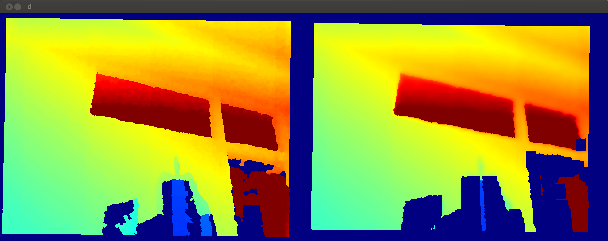
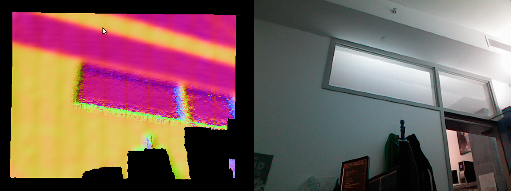

This **gpu-enhanced** library implements **edge-preserving smoothing of depth
frames** from standard rgb-d sensors as well as **surface normal extraction** at a
**frame rate of 100Hz**.



Raw depth image vs. [guided filter](http://research.microsoft.com/en-us/um/people/jiansun/papers/guidedfilter_eccv10.pdf)
smoothed image on the right. Note that similar to a [bilateral filter](https://www.cs.duke.edu/~tomasi/papers/tomasi/tomasiIccv98.pdf)
the guided filter performs edge preserving filtering as can be observed at the
sharp discontinuities of the windows.



Extracting surface normals using gradients of the depth image and a
cross-product operation yields smoothed surface normals.

### Dependencies

This code depends on the following other libraries and was tested under Ubuntu
14.04. 
- pcl 1.7 (and vtk 5.8)
- Opencv 2 (2.3.1)
- Eigen3 (3.0.5) 
- cuda 5.5 or 6.5 
- Boost (1.54)

The GPU kernels were tested on a Nvidia Quadro K2000M with compute
capability 3.0.

### Install

This package uses [the pods build
system](http://sourceforge.net/p/pods/home/Home/). Used widely at CSAIL
MIT the build system makes it easy to break up software projects into
small packages that can be checked out and compiled automatically (see
below).

- *Linux:* 

    Install Eigen3, Boost, OpenCV, and PCL

    ```
    sudo apt-get install libeigen3-dev libboost-dev libopencv-dev libpcl-1.7-all-dev
    ```

    Install the appropriate CUDA version matching with your nvidia
    drivers. On our machines we use `nvidia-340-dev` with
    `libcuda1-340 cuda-6-5 cuda-toolkit-6-5`

    Clone this repository and compile the code:

    ```
    git clone git@github.com:jstraub/rtDDPvMF; cd rtDDPvMF;
    make checkout; make configure; make -j6; make install;
    ```
    
    Note that this will checkout several other necessary repositories.
    To update all repositories run
    
    ```
    make update; make configure; make -j6; make install;
    ```
### Getting Started

Plug in your Kinect and run the following from the cudaPcl folder:
```
./build/bin/realtimeDDPvMF_openni --lambdaDeg 100 
```

### Library
*libcudaPcl.so* collects all the cuda code into one shared library. The rest
of the code is in the form of header files.

### Executables
- *openniSmoothNormals*: grab RGB-D frames from an openni device, smooth the
  depth image using a fast GPU enhanced guided filter and extract surface normals.
```
  Allowed options:
    -h [ --help ]         produce help message
    -f [ --f_d ] arg      focal length of depth camera
    -e [ --eps ] arg      sqrt of the epsilon parameter of the guided filter
    -b [ --B ] arg        guided filter windows size (size will be (2B+1)x(2B+1))
    -c [ --compress ]     compress the computed normals
```
- *openniSmoothDepth*: grab RGB-D frames from an openni device, smooth the
  depth image using a fast GPU enhanced guided filter and display it.
```
  Allowed options:
    -h [ --help ]         produce help message
    -e [ --eps ] arg      sqrt of the epsilon parameter of the guided filter
    -b [ --B ] arg        guided filter windows size (size will be (2B+1)x(2B+1))
```
- *pclNormals*: extracts normals from a general (not necessarily aligned)
  point-cloud and outputs the point-cloud with normals.
```
  Allowed options:
    -h [ --help ]         produce help message
    -i [ --input ] arg    path to input
    -o [ --output ] arg   path to output
    -s [ --scale ] arg    scale for normal extraction search radius
```
- *pclBenchmark*: display RGBXYZ point-cloud (press 'r' to reset the viewpoint)
- *pclGrabber*: grab XYZ point-cloud; press 's' to save point-cloud to "./test_pcd.pcd"

